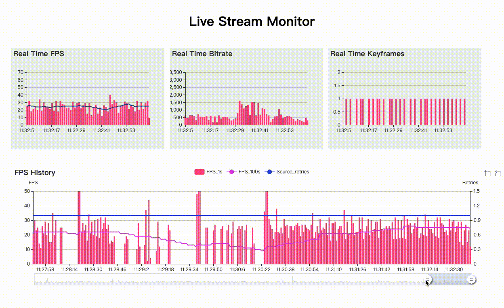

# yalsa
## Introduction
yalsa is **Yet Another Live Stream Analyzer** running in console.

yalsa is based on ffmpeg, gmf


## Usage
``` bash
./yalsa live_stream_url
```

Output example:


## How to build
Add ffmpeg library path to pkgconfig pth:
``` bash
export PKG_CONFIG_PATH=$PKG_CONFIG_PATH:/usr/local/ffmpeg/lib/pkgconfig/
```

Ensure, that PKG_CONFIG_PATH contains path to ffmpeg's pkgconfig folder.
``` bash
pkg-config --libs libavformat
```

It should print valid path to the avformat library.

Now, just run
``` bash
go get github.com/binstreamio/yalsa
```

## Links
1. https://github.com/FFmpeg/FFmpeg -- FFmpeg is a collection of libraries and tools to process multimedia
2. https://github.com/3d0c/gmf -- Go Media Framework
3. https://github.com/apache/incubator-echarts -- A powerful, interactive charting and visualization library for browser
4. https://github.com/go-bindata/go-bindata -- Turn data file into go code

